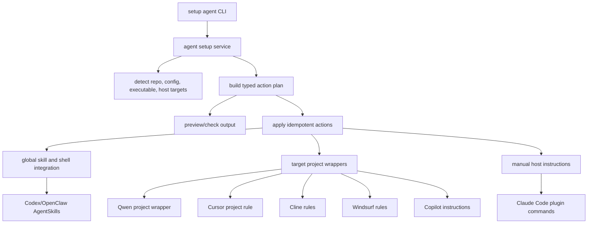

# feat: Automate Agent Setup

## Summary

Add a first-class `scholaraio setup agent` workflow that turns the current manual cross-project setup into an idempotent CLI surface. The feature should configure what ScholarAIO can safely automate, report what still requires host-specific user action, and keep agent integration behavior aligned across docs, setup diagnostics, and tests.

---

## Problem Frame

Today cross-project use requires users to combine several independent steps: install the CLI, export `SCHOLARAIO_CONFIG`, add the venv command to shell `PATH`, create a global Codex/OpenClaw skills symlink, and separately understand each agent host's wrapper model. This leaves a gap between "the CLI is callable" and "the agent can discover ScholarAIO skills and decide when to use them."

The repo already documents the integration matrix in `docs/getting-started/agent-setup.md`, `README.md`, `README_CN.md`, and `docs/guide/agent-reference.md`; the plan is to productize that matrix instead of leaving it as shell snippets.

---

## Requirements

**CLI behavior**

- R1. `scholaraio setup agent` previews planned actions by default before mutating user-level or target-project files.
- R2. `scholaraio setup agent --apply` performs idempotent installation for supported host integrations and never overwrites unrelated user content without an explicit force option.
- R3. `scholaraio setup agent check` reports CLI availability, config discovery, shell integration, global skill registration, and per-agent status in the same readable style as `setup check`.
- R4. The command supports at least Codex/OpenClaw, Claude Code, Qwen, Cursor, Cline, Windsurf, and GitHub Copilot as selectable targets, even when a target can only emit instructions rather than perform installation.

**Agent discovery and runtime configuration**

- R5. Codex/OpenClaw setup creates or verifies the global AgentSkills entry that points to ScholarAIO's canonical `.claude/skills` tree.
- R6. Shell setup writes or updates a managed block for `SCHOLARAIO_CONFIG` and the selected ScholarAIO executable path, so CLI calls from other projects use the intended runtime root.
- R7. Project-local setup can add lightweight wrapper files to a target project for agents that rely on repository-local instructions, while preserving existing target-project content.
- R8. Claude Code setup does not pretend shell code can run Claude slash commands; it prints the plugin commands and documents the expected manual action.

**Documentation and safety**

- R9. User-facing docs replace manual-only snippets with the automated command while keeping manual fallback instructions for restricted environments.
- R10. Tests cover idempotence, conflict detection, dry-run output, shell block management, target-project wrapper generation, and setup diagnostics.

---

## Key Technical Decisions

- **Create an agent setup service instead of embedding logic in the parser:** Put planning, checks, and apply behavior in a service module so CLI handlers stay thin like `scholaraio/interfaces/cli/setup.py`.
- **Use a declarative action model:** Represent each filesystem or instruction step as a typed action with `status`, `target`, `reason`, and `apply` behavior. This makes dry-run, apply, and check share one source of truth.
- **Separate global integrations from target-project wrappers:** Global integrations cover CLI config and skill discovery roots such as the Codex/OpenClaw AgentSkills path. Target-project wrappers cover files such as project rules or local agent instructions.
- **Automate only documented contracts:** Codex/OpenClaw global skills and shell configuration are automatable. Claude Code plugin install remains a displayed manual slash-command flow because it must run inside Claude Code.
- **Use managed blocks for editable user files:** Shell and target-project instruction files should get a bounded ScholarAIO block that can be updated or removed later without disturbing unrelated content.
- **Keep canonical skill source unchanged:** `.claude/skills` remains the source; `.agents/skills`, `.qwen/skills`, and `skills` stay compatibility/discovery aliases.

---

## High-Level Technical Design

The command should produce one consistent action plan, then either render it or apply the actionable subset. Host adapters decide whether their work is `auto`, `manual`, `already_ok`, `blocked`, or `not_applicable`.

---

## Scope Boundaries

- The feature does not install Python dependencies; `scholaraio setup` and installation docs keep owning package setup.
- The feature does not run Claude Code slash commands from the shell.
- The feature does not guarantee every third-party agent host has a global skill registry. When the repo only documents project-local wrappers, the CLI should manage project-local wrapper files or emit instructions.
- The feature does not move or duplicate ScholarAIO skills; it links to the canonical skill source.

### Deferred to Follow-Up Work

- Add uninstall/removal mode after the first install/check path is stable.
- Add host-specific auto-detection for future agent registries when those hosts publish stable global registry contracts.
- Add an interactive wizard wrapper around `setup agent` if repeated user feedback shows the flag surface is too dense.

---

## Implementation Units

### U1. Agent Setup Domain Model and Planner

**Goal:** Add a service-layer model that can build a host-aware setup plan without mutating files.

**Requirements:** R1, R2, R4, R5, R6, R7, R8

**Dependencies:** None

**Files:**

- `scholaraio/services/agent_setup.py`
- `tests/test_agent_setup.py`

**Approach:** Define data structures for host targets, action kinds, action statuses, and setup results. The planner should resolve the ScholarAIO root from `Config`, the canonical skill source from `.claude/skills`, the config path from the active runtime root, the executable from `sys.executable` or `shutil.which("scholaraio")`, and optional target-project paths from CLI arguments.

**Patterns to follow:** Mirror `scholaraio/services/setup.py` for bilingual user-facing strings and pure service functions. Keep filesystem access injectable enough for tests through temp directories and monkeypatched home paths.

**Test scenarios:**

- Given a temp ScholarAIO root with `.claude/skills`, building a plan for Codex/OpenClaw includes a global skill-link action and shell config actions.
- Given a missing canonical skills directory, the planner marks skill registration blocked with an actionable reason.
- Given `agents=all`, the planner includes every documented host and marks Claude Code as manual-only.
- Given no target project, project-local hosts are reported as instruction-only or pending target path rather than silently writing to the current working directory.

**Verification:** The planner returns deterministic action objects that can be rendered, tested, and applied independently.

### U2. Idempotent Filesystem Actions

**Goal:** Implement safe apply behavior for symlinks, directories, managed text blocks, and conflict reporting.

**Requirements:** R1, R2, R5, R6, R7

**Dependencies:** U1

**Files:**

- `scholaraio/services/agent_setup.py`
- `tests/test_agent_setup.py`

**Approach:** Add action executors for creating directories, creating POSIX symlinks, using Windows junction guidance where direct symlink creation is not available, and inserting managed blocks into text files. Existing correct links should be `already_ok`; existing unrelated files should be `blocked` unless a force option is explicitly set.

**Patterns to follow:** Use `pathlib.Path` for paths and keep writes narrow, similar to setup's config-file behavior. Managed blocks should use stable sentinels so repeated runs update the block once.

**Test scenarios:**

- Applying a Codex/OpenClaw plan in a temp home creates the skills parent and a link to the canonical skills tree.
- Re-applying the same plan reports `already_ok` and does not duplicate links or shell blocks.
- An existing non-link file at the skill target blocks the action and leaves the file unchanged.
- A shell file with preexisting user content receives one ScholarAIO managed block and preserves the surrounding content.
- Updating a shell block changes only the managed block when the config path or executable path changes.

**Verification:** Dry-run and apply paths produce matching action summaries, and repeated apply calls are cleanly idempotent.

### U3. CLI Surface for `setup agent`

**Goal:** Expose the planner and executor through the existing setup command group.

**Requirements:** R1, R2, R3, R4

**Dependencies:** U1, U2

**Files:**

- `scholaraio/interfaces/cli/parser.py`
- `scholaraio/interfaces/cli/setup.py`
- `scholaraio/services/agent_setup.py`
- `tests/test_cli_messages.py`
- `tests/test_agent_setup.py`

**Approach:** Add `setup agent` as a setup subcommand with flags for `--apply`, `--agent`, `--all`, `--target-project`, `--shell`, `--force`, and `--lang`. Add `setup agent check` as the diagnostic subcommand while preserving `setup check` unchanged. The default should be a non-mutating preview unless the command name or flag clearly says apply.

**Patterns to follow:** Keep `cmd_setup` as a dispatcher, like existing command handlers in `scholaraio/interfaces/cli/`. Help text should be English and concise, matching the current parser style tested in `tests/test_cli_messages.py`.

**Test scenarios:**

- Root help shows `setup agent` without regressing existing `setup check` help.
- `setup agent` without `--apply` renders a preview and does not mutate temp files.
- `setup agent --apply --agent codex` applies only Codex/OpenClaw actions.
- Invalid agent names fail argparse validation with the supported choices.
- `setup agent check --lang zh` renders localized status labels for CLI config, shell, and skills discovery.

**Verification:** The command is reachable through `scholaraio setup --help` and its behavior is covered without relying on the user's real home directory.

### U4. Host Adapters and Target-Project Wrappers

**Goal:** Encode the documented host-specific integration matrix in one place.

**Requirements:** R4, R5, R7, R8

**Dependencies:** U1, U2

**Files:**

- `scholaraio/services/agent_setup.py`
- `tests/test_agent_setup.py`

**Approach:** Add host adapters for Codex/OpenClaw, Claude Code, Qwen, Cursor, Cline, Windsurf, and GitHub Copilot. Codex/OpenClaw should manage the global AgentSkills link. Claude Code should render plugin commands. Qwen/Cursor/Cline/Windsurf/Copilot should either create target-project wrapper files when `--target-project` is supplied or report the required project-local instructions.

**Patterns to follow:** Use the repo's existing wrapper files as templates: `.qwen/QWEN.md`, `.cursor/rules/scholaraio.mdc`, `.clinerules`, `.windsurfrules`, `.github/copilot-instructions.md`, and `AGENTS.md`.

**Test scenarios:**

- Qwen target-project setup creates or updates a Qwen wrapper and skills link only under the supplied target project.
- Cursor target-project setup creates a project rule directory if missing and inserts a ScholarAIO managed rule without deleting unrelated rules.
- Cline, Windsurf, and Copilot wrappers preserve existing content and add only the managed ScholarAIO block.
- Claude Code setup output contains the plugin marketplace and install commands and marks the action as manual.
- Host adapters produce stable status summaries for `all` mode.

**Verification:** Each host adapter has unit tests for dry-run, apply, idempotence, and conflict handling where the host supports file mutation.

### U5. Setup Diagnostics Integration

**Goal:** Include agent integration status in setup diagnostics without making optional host features look like hard failures.

**Requirements:** R3, R9

**Dependencies:** U1

**Files:**

- `scholaraio/services/setup.py`
- `tests/test_setup.py`
- `tests/test_cli_messages.py`

**Approach:** Add an optional "Agent integrations" status group to `run_check` or provide a dedicated `setup agent check` diagnostic that mirrors `run_check` formatting. The diagnostic should distinguish configured, missing, optional, manual, and blocked states.

**Patterns to follow:** Existing optional checks for Semantic Scholar, Zotero, Web search, Web extract, and Paper2Any all return `ok=True` while explaining optional state. Agent checks should follow the same "status plus recommendation" style.

**Test scenarios:**

- `run_check` or `setup agent check` reports Codex/OpenClaw skills as configured when the global link points to the canonical skills tree.
- Missing global skills are reported as optional but actionable, with the `setup agent --apply` command in the detail.
- Claude Code is reported as manual/plugin-based, not failed.
- Chinese and English output both include actionable instructions without leaking absolute machine-specific paths in tests.

**Verification:** `scholaraio setup check --lang zh` remains useful for core setup, and agent-specific diagnostics do not cause unrelated setup checks to fail.

### U6. Documentation and Skill Guidance Refresh

**Goal:** Make the automated path the documented default while preserving manual fallbacks.

**Requirements:** R9

**Dependencies:** U3, U4, U5

**Files:**

- `docs/getting-started/agent-setup.md`
- `docs/getting-started/installation.md`
- `docs/guide/cli-reference.md`
- `docs/guide/agent-reference.md`
- `README.md`
- `README_CN.md`
- `.claude/skills/setup/SKILL.md`
- `tests/test_agent_entry_docs.py`
- `tests/test_writing_docs_alignment.py`

**Approach:** Update the cross-project setup guide to lead with `scholaraio setup agent`, then keep the manual symlink and plugin commands as fallback or explanation. Update the setup skill so future agents run the command instead of manually editing shell files when the user asks for cross-project use.

**Patterns to follow:** Keep entry docs lightweight; put procedural detail in `docs/getting-started/agent-setup.md` and `.claude/skills/setup/SKILL.md`.

**Test scenarios:**

- Agent setup docs mention `scholaraio setup agent` and still link to `agent-reference`.
- README and README_CN describe the automated cross-project path without duplicating the full procedure.
- The setup skill names `setup agent` as the preferred path for agent discovery registration.
- Existing entry-doc line-count and wrapper-lightness tests continue to pass.

**Verification:** Docs and skill guidance match the implemented CLI surface and do not preserve stale "manual-only" instructions as the primary path.

---

## Acceptance Examples

- AE1. From a fresh checkout with a configured venv, running `scholaraio setup agent --agent codex --apply` creates the global skill discovery entry, writes one shell managed block, and reports that a new agent session is required.
- AE2. Running the same command twice reports no new mutations on the second run.
- AE3. If a conflicting file already exists where a skills link should go, the command reports a blocked action and does not replace the file.
- AE4. Running `scholaraio setup agent --all --target-project <project>` prepares project-local wrappers for hosts with documented wrapper files and prints manual Claude Code plugin commands.
- AE5. Running `scholaraio setup agent check --lang zh` explains the difference between CLI availability, global skill discovery, project-local wrappers, and manual plugin setup.

---

## Risks & Dependencies

- **Host contract drift:** Agent hosts may change their discovery conventions. Keep host adapters small and document which integrations are automatic versus instruction-only.
- **User file safety:** Shell files and target-project instruction files are user-owned. Managed blocks and dry-run previews are required to keep this safe.
- **Cross-platform links:** POSIX symlinks and Windows junctions differ. Tests should exercise the planner's decisions without requiring privileged symlink behavior on every platform.
- **Scope creep across agents:** "All agents" should not become a full plugin manager for every host. The first release should automate only the contracts already documented in this repo.

---

## Documentation / Operational Notes

The user-facing setup flow should present three layers clearly:

- CLI runtime: command path and `SCHOLARAIO_CONFIG`.
- Skill discovery: global or project-local skill registration.
- Host-specific entry docs: plugin commands or wrapper files when skill discovery is not global.

The command should remind users to restart their agent session after changing skill discovery paths.

---

## Sources / Research

- `docs/getting-started/agent-setup.md` defines the current cross-project setup paths and manual Codex/OpenClaw symlink.
- `docs/guide/agent-reference.md` defines canonical skill source and cross-agent wrapper layout.
- `README.md` and `README_CN.md` define the public agent compatibility matrix.
- `scholaraio/services/setup.py`, `scholaraio/interfaces/cli/setup.py`, and `scholaraio/interfaces/cli/parser.py` define the existing setup command structure.
- `tests/test_setup.py`, `tests/test_cli_messages.py`, and `tests/test_agent_entry_docs.py` show the current test style for setup diagnostics, help text, and agent-entry documentation.
